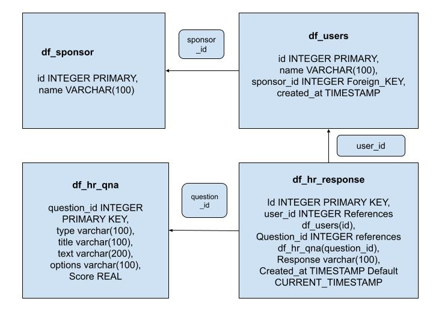

# Visit_health_assessment
The project consists of ETL tasks performed on healthcare dataset provided by Visit Health. Also conducted analysis to identify trends and gain insights into the dataset.

## Data Flow / System  Diagram

The Below image consists of workflow diagram.

The document consists of a step by step process of ETL using Postgres.

1. Read the .csv files from local and check for
    * missing records
    * duplicates.
2. Once data is checked for its sanity, based on the available data develop an ER-Diagram as shown  
   below.  

                    Fig. ER-Diagram representing relation between tables

3. The dataset consists of four tables df_sponsor,df_users,df_hr_qna,df_response and their attributes
   as shown respectively.
4. Create tables based on the above ER_Diagram.
5. Load the tables with the data from .csv files respectively.
6. Merge the tables to form a consolidated dataset.
7. Save the merged_dataframe to local for further analysis using Jupyter Notebook
8. Tools Used: Visual Studio Code, PgAdmin, Jupyter Notebook.
9. Database: Postgres

### Options for Enhancement

